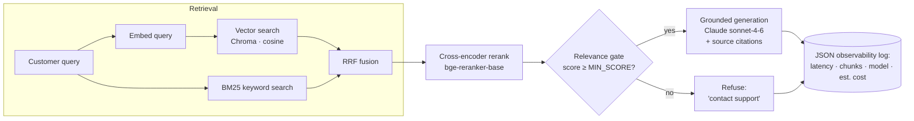

# ConnectAI

A production-grade, RAG-driven customer-support agent for an international telecom
service (international calling, mobile top-ups, billing, account & app support).
It answers customer questions **grounded only in a retrieved knowledge base**, cites
its sources, and **refuses to answer when it has no relevant context** — the trust
boundary that keeps a support bot from inventing policies or prices. The whole
system is observable, evaluated on every commit, and runs with `docker compose up`.

> Built as a portfolio project for an Applied/Junior AI Engineer role. It exercises
> the full stack a production RAG system needs: hybrid retrieval, cross-encoder
> reranking, grounded generation with an abstention gate, a CI-gated evaluation
> harness, structured observability, Docker, and GitHub Actions.

---

## Architecture



**Flow:** `query → hybrid retrieve (vector ‖ BM25 → RRF) → cross-encoder rerank →
relevance gate → grounded generation with citations → structured log`.

Key design choices:
- **Hybrid retrieval (RRF):** dense vector search catches paraphrases; BM25 catches
  exact terms (operator names, error wording). Reciprocal Rank Fusion combines them
  without needing comparable score scales.
- **Cross-encoder reranking:** re-scores each (query, chunk) pair jointly for
  precision the first-stage retrievers can't reach.
- **Abstention gate:** if the best reranked chunk scores below `MIN_SCORE`, the agent
  refuses instead of guessing. This is the AI-safety boundary for a support bot.
- **Grounded generation:** Claude answers **only** from retrieved context and always
  returns a source citation. With no `ANTHROPIC_API_KEY`, a deterministic extractive
  fallback runs instead — so evaluation, tests and CI cost nothing and need no secrets.

---

## Evaluation results

Run with `python -m connectai.eval` (self-ingests if needed; writes
`eval_results.json` + `eval_report.md`). Measured on 18 articles → 48 chunks, with a
labelled set of **23 in-corpus** queries and **2 deliberately out-of-corpus** queries:

| Metric | Value |
|---|---|
| Hit Rate@5 | **1.00** |
| MRR | **0.971** |
| Recall@5 | **1.00** |
| Refusal accuracy (out-of-corpus) | **1.00** |

The eval doubles as a **CI regression gate**: GitHub Actions fails the build if
Hit Rate@5 drops below `0.70`, so a retrieval regression can't be merged silently.

> Retrieval scores are high because the knowledge base is small and topically clean;
> MRR < 1.0 shows the harder queries (e.g. an auto-recharge question whose answer sits
> mid-article) aren't all rank-1. The gate threshold is **calibrated** against the
> observed score distribution — see *What I'd build next*.

---

## Run it locally

### Option A — Docker (recommended)

```bash
docker compose up --build
# first boot downloads the embedding + reranker models and ingests the KB
# then open the chat UI in a browser:
open http://localhost:8000
curl -s localhost:8000/health
curl -s -X POST localhost:8000/chat \
  -H 'content-type: application/json' \
  -d '{"message":"How do I send a top-up to a number in the Philippines?"}'
```

Set a real Claude key for natural-language answers (optional):

```bash
echo "ANTHROPIC_API_KEY=sk-ant-..." > .env && docker compose up --build
```

### Option B — Local Python

```bash
python -m venv .venv && source .venv/bin/activate
pip install -e ".[dev]"

python -m connectai.ingest      # build the Chroma index from data/kb
python -m connectai.eval        # print metrics + write eval_results.json
python -m connectai.cli         # interactive support chat in the terminal
uvicorn connectai.api:app       # serve the API + web UI on :8000
```

Then open **http://localhost:8000** for the chat UI.

### API

| Method | Path | Purpose |
|---|---|---|
| `GET` | `/` | Single-page chat UI |
| `POST` | `/chat` | Grounded answer with citations for a customer question |
| `GET` | `/metrics` | Aggregated observability (request count, avg/p95 latency, est. cost, gated rate) |
| `GET` | `/health` | Readiness + indexed chunk count + active generation backend |

---

## Tech stack

- **Language:** Python 3.12+, fully type-hinted (`mypy` clean, `ruff` clean)
- **Retrieval:** ChromaDB (vector) + `rank-bm25` (keyword), fused with RRF
- **Embeddings:** `sentence-transformers` `BAAI/bge-small-en-v1.5` (local, free; OpenAI `text-embedding-3-small` available via config)
- **Reranking:** `BAAI/bge-reranker-base` cross-encoder
- **Generation:** Anthropic Claude `claude-sonnet-4-6` (deterministic fallback when key-less)
- **API & UI:** FastAPI + Uvicorn, with a single-page vanilla-JS chat UI (no build step)
- **Observability:** structured JSON request logs + `/metrics` aggregation
- **Quality gate:** pytest, ruff, mypy, and a CI-gated eval harness via GitHub Actions
- **Packaging:** Docker + docker-compose

---

## What I'd build next

Production thinking, deliberately scoped out of this portfolio cut:

1. **Learned abstention calibration.** The refusal gate currently uses a single
   threshold calibrated on the eval set. I'd fit it on a held-out validation split,
   track precision/recall of refusals as a first-class metric, and consider a small
   classifier over reranker features instead of one cutoff.
2. **Answer-faithfulness eval.** Today's harness scores *retrieval*. I'd add an
   LLM-as-judge faithfulness/groundedness score (and citation-correctness) to the CI
   gate so generation regressions are caught too.
3. **Kubernetes deployment.** Containerised already; next is a Helm chart with
   horizontal autoscaling, readiness/liveness probes (the `/health` endpoint is ready),
   and a managed vector store (pgvector/Pinecone) instead of embedded Chroma.
4. **Observability backend.** Ship the JSON traces to Langfuse/OpenTelemetry for
   dashboards, per-route cost tracking, and latency alerting rather than a local file.
5. **Multilingual support.** Rebtel's users span 31 countries — swap in a multilingual
   embedding + reranker and add per-language eval sets.
6. **Feedback loop on the UI.** The chat UI ships today; next is thumbs-up/down on each
   answer whose signals feed back into the eval set, closing the loop between production
   and evaluation.
```
